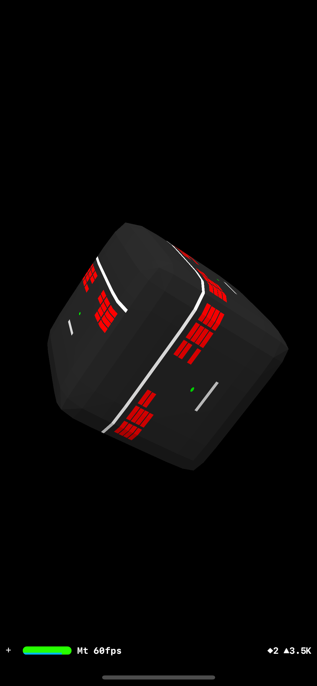

# 2D Breakout game playable as texture on a rotating cube
An Xcode12 project for iOS that implements a simple 2D SpriteKit "Break Out" style game. The SKScene is used as a material mapped to the sides of a rotating SceneKit 3D cube. The game is playable. Pan to move the paddle. This example was created in Wright State University CS-3170 "Mobile Apps" on Oct. 29, 2021 as a demonstration of the following:

- A very small game that shows to power of SpriteKit and the built-in physics engine with almost no code
- Integration of frameworks for cool and challenging play as the game moves around in 3D space.

